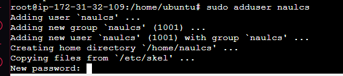
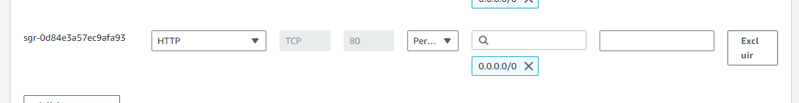

Projeto 1 - Sistemas Operacionais Linux

Baseado em todo o conhecimento adquirido durante o módulo, realizarei as práticas sugeridas documentando todo o processo realizado usando printscreens sempre que possível.

Assuntos que serão abordados:

Gestão de usuários
Permissionamento
Configuração de Serviços

Problema 1:
Imagine que a Vanessa é uma administradora de sistemas em uma empresa de tecnologia. Ela recebeu a tarefa de criar uma nova conta de usuário para um novo membro da equipe. Vanessa precisa demonstrar seu conhecimento ao explicar o processo para seus colegas de trabalho.

1 - Abrir o terminal: Primeiro, precisamos abrir o terminal. Isso pode ser feito pressionando Ctrl + Alt + T, caso use o sistema EC2 da AWS, ao se conectar ele já trará o terminal aberto.


2 - Usar o comando ```adduser```: No terminal, você pode usar o comando adduser para criar uma nova conta de usuário.

<pre class="copyable">
sudo adduser nome_do_usuario
</pre>

Mude o campo ```nome_do_usuario``` para o nome de usuario que deseja criar.


Após digitar o comando pressione enter, ele irá solicitar que seja inserida uma senha para o usuario a ser criado. 




Após digitar a senha do novo usuario e repeti-la para confirmar, ele solicitará os dados do usuario a ser criado e perguntará se deseja confirmar os dados informados.


Corrija as informações, caso esteja correto, digite ```Y``` para confirmar, caso não esteja pressione ```N``` para retornar aos campos e edita-los novamente.

Para verificar se o usuario foi criado você pode digitar:

<pre class="copyable">
cat /etc/passwd | grep nome_do_usuario
</pre>


Problema 2:
Em uma pequena cidade chamada Linuxville, vive o Lucas, um entusiasta de tecnologia. Ele está ajudando seu amigo Rafael a entender o funcionamento das permissões de arquivo no sistema Linux. Lucas decide contar uma história, explicando que os arquivos em Linux são como valiosos tesouros guardados em cofres. Cada cofre possui uma combinação única de permissões, representadas por símbolos especiais. Lucas usa essa analogia para explicar como as permissões de arquivo são representadas e qual o acesso que cada símbolo representa.

Crie uma Pasta qualquer e 5 arquivos de texto. Em seguida define as permissões 400 para a pasta e todos os arquivos recursivamente. Use esse exemplo para explicar o que são as permissões de arquivo no Linux e como elas são representadas de forma mais detalhada possível.

1- Criando uma pasta: Primeiro, vamos criar uma pasta chamada cofre e cinco arquivos de texto dentro dela:


<pre class="copyable">
mkdir cofre

touch Cofre/tesouros{1..5}.txt
</pre>


Podemos utilizar o comando ```ls - l nome_da_pasta``` para verificar os arquivos

<pre class="copyable">
ls -l cofre
</pre>


Agora, temos uma pasta chamada ```cofre``` com cinco arquivos de texto. Vamos definir as permissões para ```400``` para a pasta e todos os arquivos recursivamente:


<pre class="copyable">
sudo chmod -R 400 cofre
</pre>


A permissão ```400``` significa que o proprietário do arquivo tem permissão de leitura, e ninguém mais tem permissão para fazer nada. Isso é representado como ``` -r--------```.


Problema 3:
Em uma cidade futurística chamada Adalandia, existe uma equipe de jovens DevOps liderada pela Andreza. Eles estão trabalhando em um novo projeto e precisam configurar um servidor web para hospedar sua aplicação. Andreza, como líder do time, guia seus colegas pelo processo de instalação e configuração do servidor Nginx, compartilhando suas experiências passadas com a ferramenta e fornecendo orientações detalhadas para garantir uma configuração correta.

Descreva o processo para instalar e configurar o servidor Web Nginx no Linux. O Objetivo é alterar a página Default do Nginx para os seguintes caracteres:

``ADA + AdaTech + seu_nome = Sucesso!``

Apenas esse texto deve ser renderizado na página padrão do servidor. Não esqueça de tirar um print e documentar tudo que foi feito até chegar a esse resultado.


1 - Instalação do Apache: Primeiro, precisamos instalar o Apache. No Ubuntu, podemos fazer isso com o seguinte comando:

<pre class="copyable">
sudo apt update
sudo apt install apache2
</pre>


Ao final ele irá perguntar se vc deseja continuar, escolha ``Y`` para continuar.


Para acessar a pagina do apache, basta digitar no navegador o ip da sua maquina, seja ela fisica ou virtual, após isso, caso tudo esteja funcionando, ele abrirá a pagina web.


Caso não consiga visualizar a pagina, verifique se a regra de segurabça está com o protocolo http liberado na porta 80.



2 - Alterando a página padrão do Apache: A página padrão do servidor web Apache está localizada em ``/var/www/html/index.html``. Você pode usar um editor de texto (como nano ou vim) para modificar esse arquivo.

<pre class="copyable">
sudo nano /var/www/html/index.html
</pre>

Ele abrirá em seguida a tela onde poderá modificar o arquivo desejado. 


Após edição, para atualizar a pagina web para verificar a modificação. 

